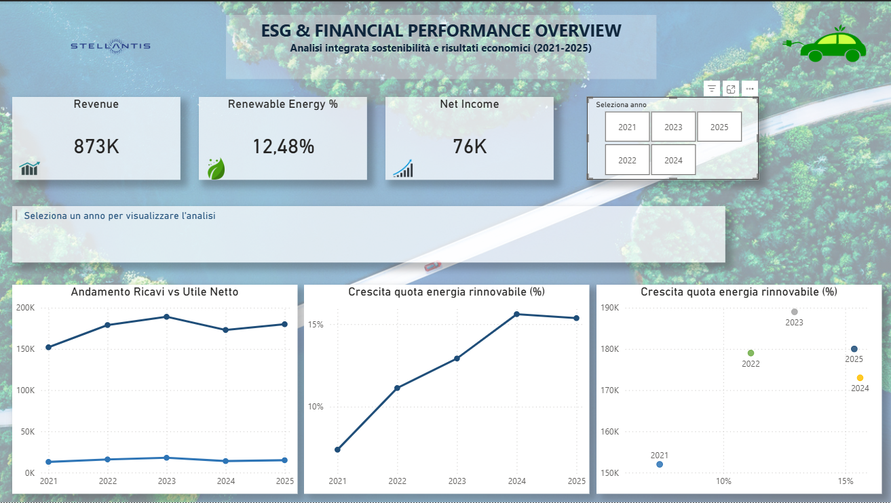

# Analisi finanziaria ESG di Stellantis

## Descrizione del progetto
Questo progetto analizza la relazione tra indicatori ESG (Environmental, Social, Governance) e performance finanziarie del gruppo Stellantis nel periodo 2021–2025.

L’obiettivo è comprendere se la crescita degli investimenti sostenibili e della quota di energia rinnovabile abbia avuto un impatto sui principali KPI economici dell’azienda.

---

## Tecnologie utilizzate

- Python
- Pandas
- Matplotlib
- Jupyter Notebook
- Power BI

---

## Dataset utilizzati

I dati utilizzati provengono da fonti ufficiali Stellantis:

- ESG Performance Indicators
- Sustainability Statement
- Annual Reports
- Climate Report

---

## Contenuti del repository

| File | Descrizione |
|------|-------------|
| 01_comprensione_dei_dati.ipynb | Notebook Python per pulizia e analisi dati |
| capstone_powerBi.pbix | Dashboard interattiva Power BI |
| report_finale.pdf | Report finale del progetto |
| dashboard.png | Anteprima dashboard |
| Presentazione ESG_Stellantis.pptx | Presentazione finale |

---

## Obiettivi dell’analisi

- Analizzare trend ESG e finanziari
- Studiare la crescita della quota di energia rinnovabile
- Confrontare ricavi e utile netto
- Evidenziare correlazioni tra sostenibilità e performance economiche
- Analizzare il confronto tra 2024 e 2025

---

## Risultati principali

L’analisi mostra una crescita progressiva della quota di energia rinnovabile accompagnata da performance economiche generalmente stabili o positive.

I risultati suggeriscono una possibile relazione positiva tra strategia ESG e solidità economico-finanziaria, pur senza dimostrare una causalità diretta.

---

## Dashboard Preview

---

## Autore

Leonardo Di Padova
Capstone Project – EPICODE Data Analyst Master
